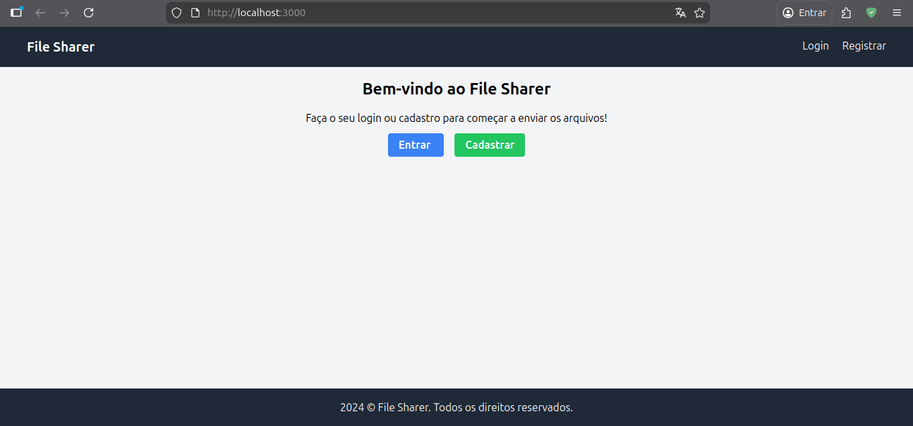
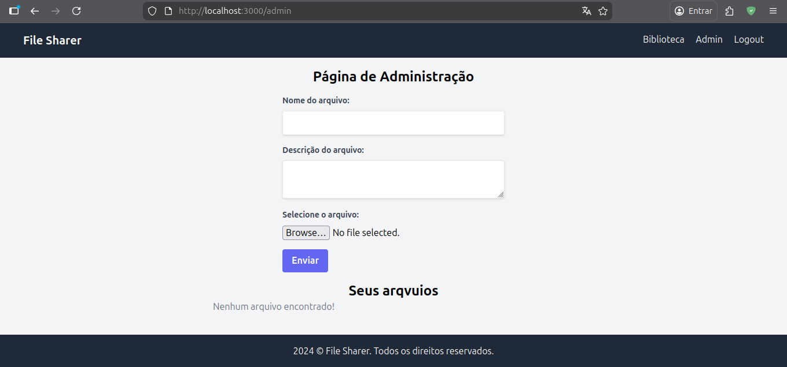
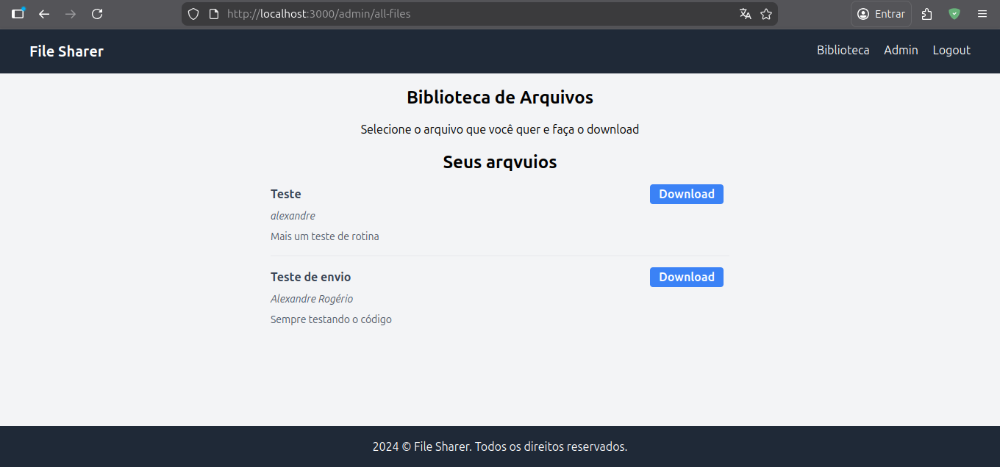

# Project HTMX File Sharer

A simple and efficient file sharing application built with a focus on modern, lightweight technologies. This project demonstrates the power of **HTMX** combined with a robust **Node.js/Express** backend to create a dynamic user experience without the complexity of heavy frontend frameworks.

## 🚀 Technologies Used

- **Backend:** [Node.js](https://nodejs.org/) & [Express](https://expressjs.com/)
- **Frontend Interaction:** [HTMX](https://htmx.org/) (High Power Tools for HTML)
- **Templating Engine:** [EJS](https://ejs.co/) (Embedded JavaScript templates)
- **Styling:** [Tailwind CSS](https://tailwindcss.com/)
- **Database:** [SQLite](https://www.sqlite.org/) with [Sequelize ORM](https://sequelize.org/)
- **Authentication:** [Express-session](https://www.npmjs.com/package/express-session) & [Bcrypt](https://www.npmjs.com/package/bcrypt)
- **File Uploads:** [Multer](https://github.com/expressjs/multer)

## 📂 Project Structure

```text
.
├── app.js
├── config
│   ├── config.json
│   ├── multerConfig.js
│   └── styles.css
├── database.sqlite  # Not versioned
├── middleware
│   └── isAuthenticated.js
├── migrations
│   ├── 20240409204231-create-user.js
│   └── 20240409204802-create-file.js
├── models
│   ├── file.js
│   ├── index.js
│   └── user.js
├── package.json
├── prettier.config.js
├── public
│   ├── css
│   │   └── styles.css
│   └── js
│       └── scripts.js
├── routes
│   ├── admin.js
│   └── auth.js
├── sessions         # Not versioned
├── tailwind.config.js
├── uploads          # Not versioned
└── views
    ├── admin.ejs
    ├── allfiles.ejs
    ├── index.ejs
    ├── layout.ejs
    ├── login.ejs
    ├── partials
    │   ├── allFilesList.ejs
    │   ├── footer.ejs
    │   ├── header.ejs
    │   ├── message.ejs
    │   └── userFiles.ejs
    └── register.ejs
```

## 🛠️ How to Execute

### 1. Standard Method (Node.js)

To run the project normally using the built-in Express server:

1. **Install dependencies:**

   ```bash
   npm install
   ```

2. **Start the server:**

   ```bash
   node app.js
   ```

3. **Access in browser:**
   Open [http://localhost:3000](http://localhost:3000)

### 2. Live Server Development

If you want to use a "Live Server" style experience during development, follow these steps:

> [!NOTE]
> Since this is a Node.js backend application, the VS Code "Live Server" extension alone will not work for dynamic routes.

#### Recommended Development Workflow:

- Use **Nodemon** (optional but recommended) to automatically restart the server on file changes:

  ```bash
  npx nodemon app.js
  ```

- **Live CSS Rebuilding:**
  Run the follow command in a separate terminal to watch and compile Tailwind CSS changes:

  ```bash
  npm run build-css
  ```

## 📸 Screenshots

The following images demonstrate the application interface:




